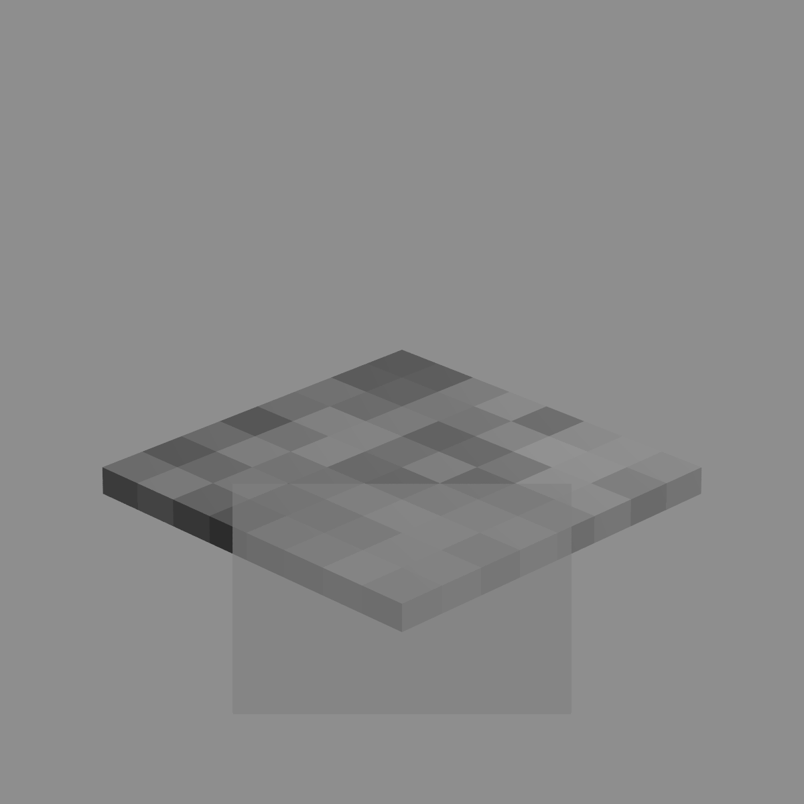
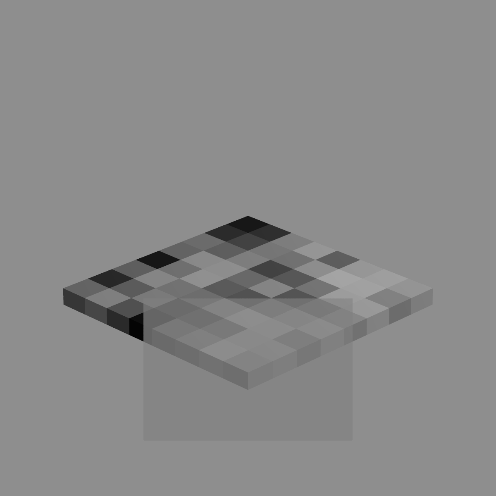

# povgen (checkerboard) - a script generator
POV-Ray checkerboard script generator

Generates a POV-Ray script that renders a checkerboard with an overlaying cutout, similar to the graphic in this article:\
[Conjoint measurement of perceived transparency and perceived contrast in variegated checkerboards](https://jov.arvojournals.org/article.aspx?articleid=2778331)\
by Guillermo Aguilar, Marianne Maertens

| Background  | Foreground for cutout |
| ------------- | ------------- |
|   |   |

| Mask  | Result  |
| ------------- | ------------- |
|   |   |
